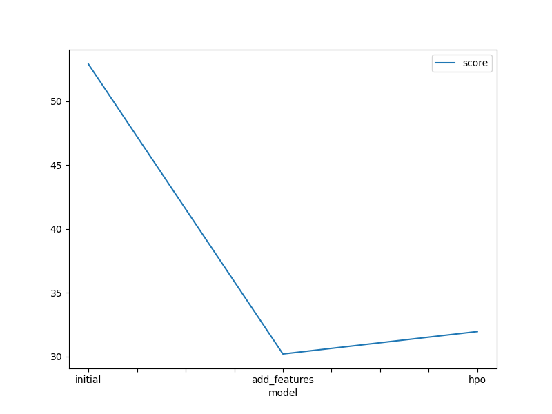
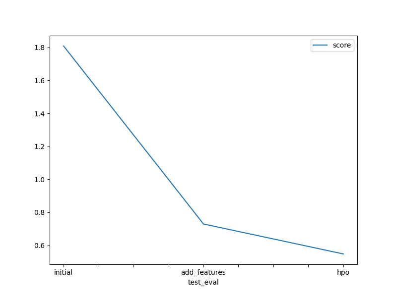

# Report: Predict Bike Sharing Demand with AutoGluon Solution
#### Rohit Patel

## Initial Training
### What did you realize when you tried to submit your predictions? What changes were needed to the output of the predictor to submit your results?
Kaggle doesn't takes negative values so we had to make all the -ve values to zero

### What was the top ranked model that performed?
WeightedEnsemble_L2

## Exploratory data analysis and feature creation
### What did the exploratory analysis find and how did you add additional features?
The data was dependent on many factors such as weather, season etc. however more features can be added which would contribute to increase the model's ability such as time of day and year and month etc. These things also affect the target.

### How much better did your model preform after adding additional features and why do you think that is?
After adding some addtional features the model improved drastically. That is due to these are some hidden factors which contributes towards the prediction of target and with the addition of new features the model can directly focus on these.

## Hyper parameter tuning
### How much better did your model preform after trying different hyper parameters?
After trying different hyper parameters the model performs much better than before. There was a huge change in score and gives much better results.

### If you were given more time with this dataset, where do you think you would spend more time?
I would pick the best model given by the AutoGloun and try to tune it more.

### Create a table with the models you ran, the hyperparameters modified, and the kaggle score.
|model|time_limit|hyperparameters|score|
|--|--|--|--|
|initial|600|default|1.80856|
|add_features|600|default|0.72935|
|hpo|1800|multimodal|0.54755|

### Create a line plot showing the top model score for the three (or more) training runs during the project.

TODO: Replace the image below with your own.

### Create a line plot showing the top kaggle score for the three (or more) prediction submissions during the project.

TODO: Replace the image below with your own.

## Summary
Just a little feature engineering and a slight change in hyperparameters can lead to much better performance of models. If we were to give it more time and set up things more properly we can achieve much much better results.
